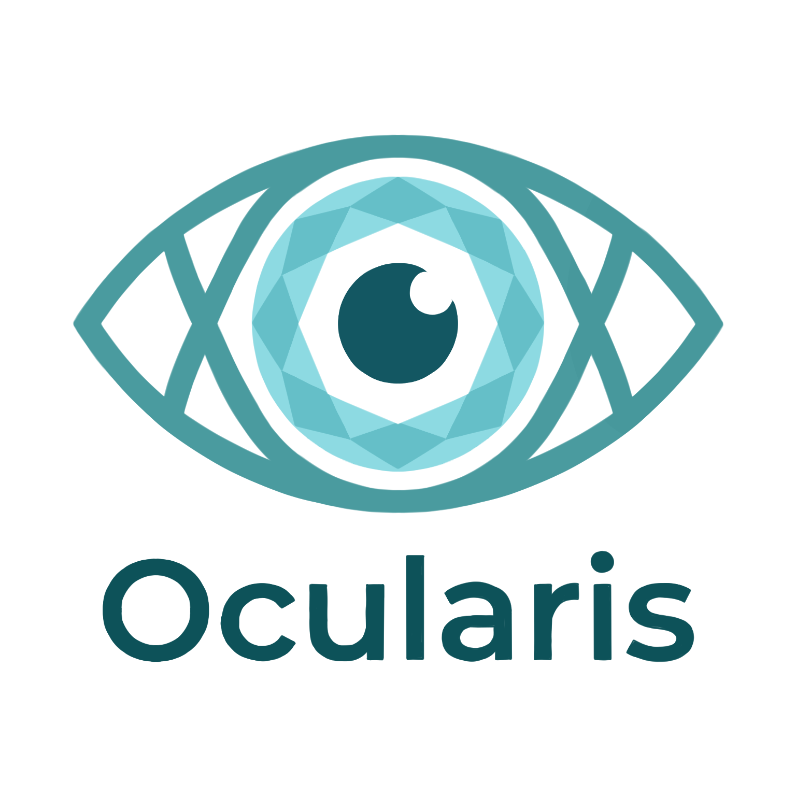
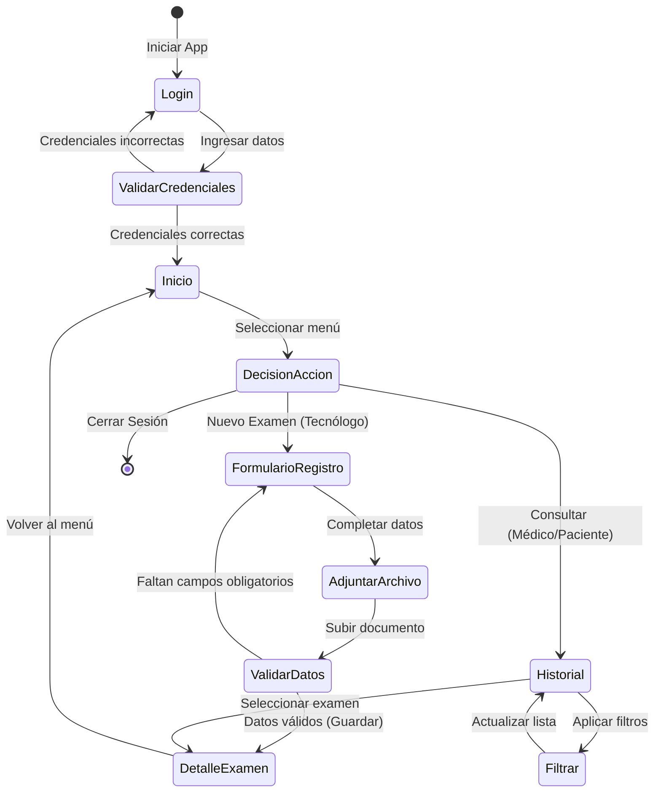

# Ocularis
**App móvil para consulta y trazabilidad de exámenes oftalmológicos**

Ocularis es una aplicación móvil orientada a centralizar, organizar y dar trazabilidad al acceso y consulta de exámenes oftalmológicos en un contexto académico con datos simulados.

## Identidad Visual
* **Logotipo:** 

  

* **Paleta de Colores:** 

| Color | Código | Vista Previa |
| :--- | :--- | :--- |
| **Fondo** | `#FFFFFA` |  |
| **Texto** | `#0D5C63` |  |
| **Secundario** | `#44A1A0` |  |
| **Adicional** | `#78CDD7` |  |
| **Principal** | `#247B7B` |  |

## Flujo de Usuario

## Pantallas Principales
Los diseños de las interfaces de Ocularis se encuentran ubicados en el repositorio dentro del directorio `docs/diseno/interfaces/`. Las pantallas generadas para este MVP son:
* Login
* Inicio / Búsqueda
* Registro de Atención
* Historial de Exámenes
* Registro de Examen (Subir Archivos)
* Resumen / Detalle

## Tecnologías Utilizadas
* **Google Stitch:** Generación y prototipado de UI con IA.
* **coolors.co:** Definición de la paleta de colores.
* **planttext.com:** Generación del diagrama de flujo UML.
* **Material Design 3 (m3.material.io):** Sistema de diseño y componentes base.

## Integrantes
**Equipo Bizcochitos**
* **Richard Hernández:** Líder
* **Cesar Molina:** Frontend
* **Matias Carrasco:** Backend
